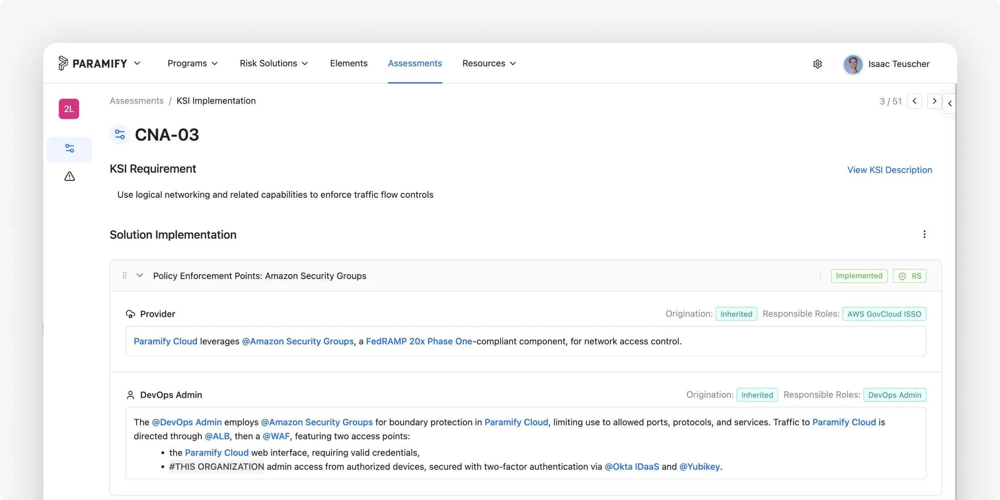
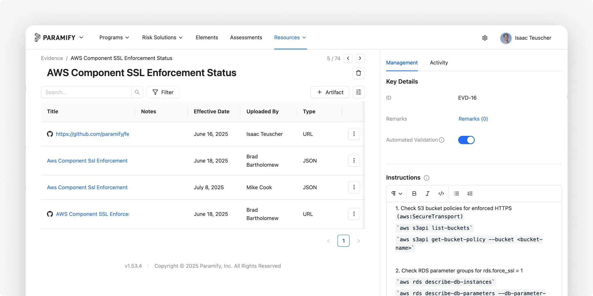
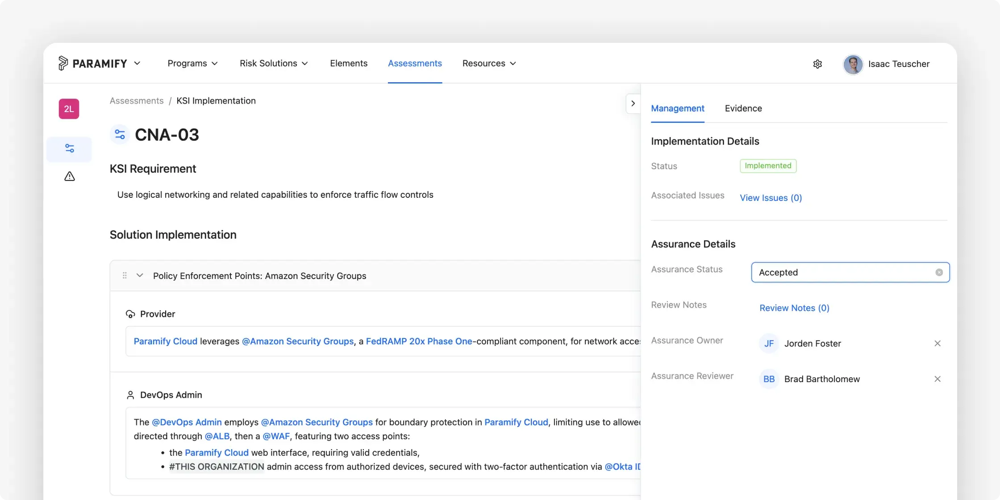
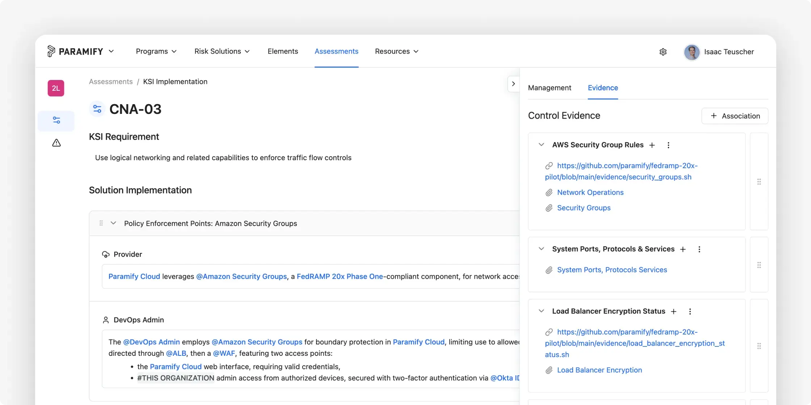
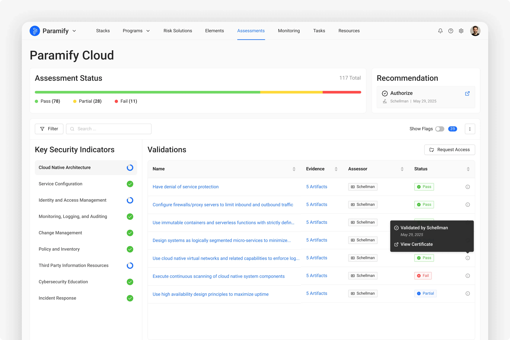
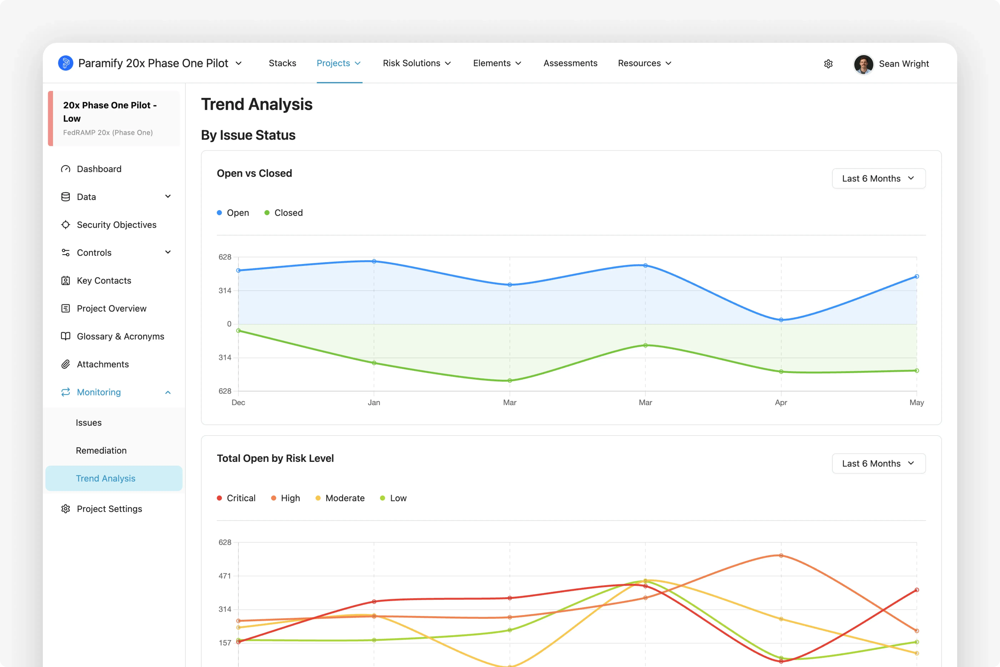
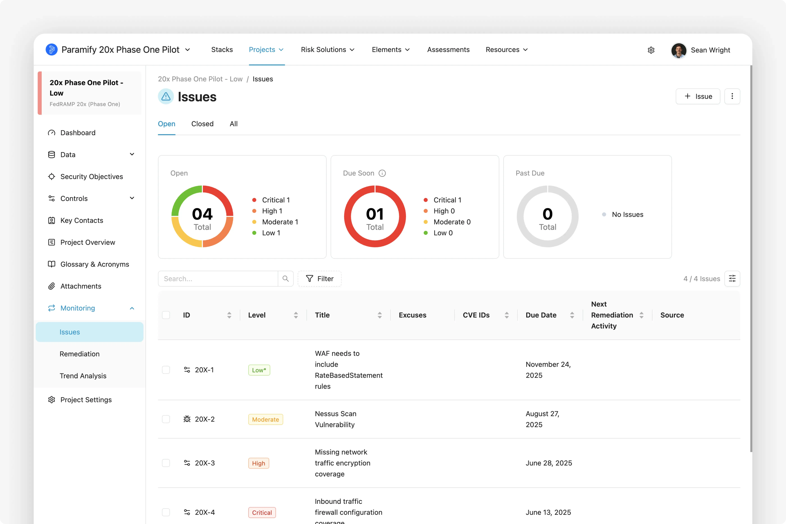

<p align="center">
   <a href="https://filevine.com">
     
   </a>
</p>

# Filevine's FedRAMP 20x Phase One Pilot Final Submission

## Filevine Overview

The **Filevine Application Suite** (Filevine) is a leading legal and case management software platform that streamlines workflows, enhances collaboration, and automates compliance for organizations that manage sensitive data. Filevine enables law firms, government agencies, and enterprises to securely manage cases, contracts, and compliance documentation with full auditability and reporting. Trusted by thousands of organizations across the legal and regulatory ecosystem, Filevine empowers teams to meet strict compliance standards while maintaining operational efficiency.

Our first product of entry for FedRAMP from the Filevine suite is Vinesign, which is the single product in scope for this package submission. Vinesign is Filevine’s secure e-signature solution that allows users to send, sign, and manage documents digitally within a fully compliant and audit-ready environment. Integrated seamlessly into the Filevine platform, Vinesign simplifies contract execution and client communications by replacing paper-based workflows with fast, mobile-friendly electronic signatures.

---

## ☁️ CSP Approach

Our approach can be summarized with the following steps:

1. **Lightweight Documentation**  
   Document the implementation of KSIs of the Filevine Application Suite using Paramify's FedRAMP 20x validations set.

2. **Key Security Indicators and Validations**  
   Gather and upload evidence into Paramify for each KSI validation, using automation where possible.

3. **Validate Evidence**  
    Meet with 3PAO and have them review and validate evidence in Paramify for the Filevine Application Suite.

4. **Automate Machine-readable Package**  
   Generate and publish the requested machine-readable package using Paramify.  

5. **3PAO Review**  
   3PAO reviews the package and adds attestation into the Paramify Portal.

6. **Continuous Reporting Indication**  
   Either on-demand or per an automated schedule, a new package will be generated with the most current evidence.

7. **Prototype for Continuous Reporting**  
   It is anticipated that Paramify will allow for a shareable link that shows the KSI dashboard or enable auditors and customer driven assessments in the future.

8. **CSP Rationale and Summary**  
   Summary of and rationale for the approach used to generate the machine-readable file, and evidence generation methods.  It is utilizing the Paramify export capability.

9. **CSP Submission**  
   Access the assessment via a viewable link in Paramify via request.

---

## Step-by-Step Details

### Step 1 – Lightweight Documentation
Document the implementation of our KSIs of the Filevine Application Suite using Paramify with the FedRAMP 20x validations set.


### Step 2 – Key Security Indicators and Validations
Gather and upload evidence into Paramify for each KSI validation, using automation where possible. Instructions and commands for each evidence object are included to provide context to the evidence process and results.


Filevine primarily utilizes Wiz today for evidence collection.  Wiz is a cloud security posture management (CSPM) tool that helps organizations identify and remediate security risks in their cloud environments.  In the near future, Filevine will be integrating Wiz with Paramify to automate evidence collection and validation.  This will allow for continuous monitoring and reporting of security controls, ensuring that the Filevine Application Suite remains compliant with FedRAMP requirements.

### Step 3 – Validate Evidence
Meet with 3PAO and have them review and validate evidence in Paramify for the Filevine Application Suite. 3PAO can set Assurance Steps/Results, Assurance Status, and leave notes or remarks. 



Filevine is working with Coalfire as 3PAO for this FedRAMP 20x Assessment. 

### Step 4 – Automate Machine Readable Package
Publish our machine-readable format package using Paramify’s export capabilities.

Our draft package submission is represented using YAML due to its simplicity.  Though YAML is Paramify's current proposal, Paramify can support OSCAL, JSON, or other common formats.

---

## 📑 Assessment File Structure
The machine-readable assessment file is a YAML file with the following structure (see [machine-readable-package/schema.yaml](machine-readable-package/schema.yaml)):

```yaml
Package:
  CSPName: <Company name of Cloud Service Provider>
  CSO: <Cloud Service Offering / Name of application>
  impact: <Low | Moderate | High>
  summaryOfCSO: <Description of CSO>
  Assessments:
  - Assessment:
    digitalSignature: <SHA hash of assessment elements below>
    assessorOrg: <Third Party Assessment Organization>
    date: <date of assessment>
    leadAssessor: <name of lead assessor>
    recommendation: <Authorize | Do Not Authorize>
    remarks: <assessment remarks>
    KSIs:
    - KSI:
      name: <name of KSI>
      shortName: <shortname of KSI>
      status: <status of implementation - Complete | Incomplete>
      Validations:
      - validation:
        id: <validation id>
        shortName: <shortname of validation>
        description: <description of validation>
        implementation: <short description of approach>
        implementationStatus: <True | False | Partial>
        digitalSignature: <SHA hash of validation elements>
        assessmentStatus: <True | False | Partial >
        assessedBy: <name of assessor>
        assessedOn: <date validation was assessed>
        remarks: <remarks from assessor>
        Evidences:
        - evidence:
          id: <evidence id>
          name: <name of evidence>
          description: <description of evidence>
          instructions: <how to retrieve evidence>
          automated: <True | False>
          commands: <computer instruction used if automated>
          scriptName: <filename>
          validationRules:
          - rule:
            id: <rule id>
            textValue: <value to look for in output file>
          validatedBy: <name of assessor>
          validateDate: <date evidence was validated>
          remarks: <remarks from assessor>
          Artifacts:
          - artifact:
            name: <name of artifact>
            reference: <evidence file>
            outputResults: <output of script if automated>
            effectiveDate: <date of evidence>
```

---

**Below is a sample YAML file:**
```yaml
Package:
 CSPName: Filevine
 CSO: Filevine Application Suite
 impact: Low
 summaryOfCSO: (Filevine) is a leading legal and case management software platform that streamlines workflows, enhances collaboration, and automates compliance for organizations that manage sensitive data.
 Assessments:
   - Assessment:
       digitalSignature: 7b23c3e01fca304e1f34d5fe1aa57c594de3e810
       assessorOrg: Coalfire
       date: 7/14/2025
       leadAssessor: Pete Waterman
       recommendation: Authorize
       remarks: All evidence satisfied the KSIs. This assessment was performed by reviewing the evidence artifacts and validations provided.
       KSIs:
         - KSI:
             name: Cloud Native Architecture
             shortName: KSI-CNA
             status: Complete
             Validations:
               - validation:
                   id: 1
                   shortName: KSI-CNA-1
                   description: Have denial of service (DoS) protection
                   implementation: AWS WAF
                   implementationStatus: True
                   digitalSignature: 6b7bf289ee3f5e33750b507576c94183b59ae246
                   assessmentStatus: True
                   assessedBy: Pete Waterman
                   assessedOn: 6/30/2025
                   remarks: Having reviewed the WAF rules script and evidence artifacts...
                   Evidences:
                     - evidence: 
                         id: 1.1
                         name: WAFrulesconfig
                         description: WAF rules config
                         instructions: List all web ACLs to identify the ones with DoS protection
                         automated: True
                         commands: aws wafv2 list-web-acls; aws wafv2 get-web-acl
                         scriptName: waf_DoS_rules.sh
                         validationRules: 
                           - rule:
                               id: 1.1
                               textValue: RateBasedStatement
                         validatedBy: Pete Waterman
                         validateDate: 6/29/2025
                         remarks: The script result includes a rule with priority 1, rate based limit of 2000...
                         Artifacts:
                           - artifact:
                               name: WAF DoS Rules Result
                               reference: waf_dos_rules.json
                               outputResults: |
                                 {
                                    "results": [
                                      {
                                        "WebACLId": "fb14t971-0bfc-4f57-970c-16gjd7ae0566",
                                        "WebACLName": "WAFv2-web-acl",
                                        "Rules": [
                                          {
                                            "Name": "rate-limit-rule",
                                            "Priority": 1,
                                            "Statement": {
                                              "RateBasedStatement": {
                                                "Limit": 2000,
                                                "AggregateKeyType": "IP"
                                              }
                                            },
                                            "Action": {
                                              "Block": {}
                                            ...
                                  }
                               effectiveDate: 5/23/25
```

Paramify's delivered complete machine-readable file is available publicly in this repository at [machine-readable-package/filevine-coalfire-2025-assessment.yaml](machine-readable-package/filevine-coalfire-2025-assessment.yaml)

### Step 5 - 3PAO Review
The 3PAO reviews the package and submits it directly to the FedRAMP PMO.  

<!-- 3PAO reviews package and adds attestation. This is included at the Assessment level in the machine-readable package
```
  - Assessment:
    digitalSignature: <SHA hash of assessment elements below>
    assessorOrg: <Third Party Assessment Organization>
    date: <date of assessment>
    leadAssessor: <name of lead assessor>
    recommendation: <Authorize | Do Not Authorize>
    remarks: <assessment remarks>
``` -->

### Step 6 - Continuous Reporting Indication
Either on-demand or per an automated schedule, a new package will be generated with the most current evidence using Paramify's export capability.

### Step 7 - Prototype for Continuous Reporting
It is anticipated that Paramify will allow for a shareable link that shows the KSI dashboard. The view will look similar to the following images.






### Step 8 - CSP Rationale and Summary
A summary of and rationale for the approach used to generate the machine-readable file, and evidence generation methods is provided with the machine-readable package file.

### Step 9 - CSP Submission
Similar to the Continuous Reporting capability, the package is available by a viewable link in Paramify or through the machine-readable package file with a friendly HTML viewer.

Filevine's complete machine-readable file is available publicly in this GitHub repository at [machine-readable-package/filevine-coalfire-2025-assessment.yaml](machine-readable-package/filevine-coalfire-2025-assessment.yaml)

An example of the HTML viewer (free and open-source, operates offline based on YAML machine-readable package file) can be accessed in the [html-dashboard directory](https://github.com/filevine/fedramp20x-low-submission/tree/main/html-dashboard).   This is cloned from the [Paramify repository](https://github.com/paramify/fedramp-20x-pilot/tree/main/html-dashboard).

---

## 📩 Contact
Reach out to fedramp@filevine.com for questions, demos, or 3PAO access.
